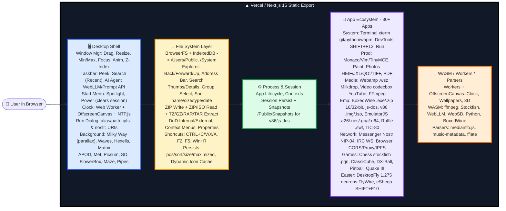

# 🌀 Labyrinth OS
### A Browser-Based Desktop Operating System


A full **Windows-like desktop environment running entirely in the browser** — complete with desktop UI, taskbar, start menu, window management, file system, terminal, browser, media players, editors, games, and emulators. Built as a web app, not just a website.

It behaves like a mini OS: drag, resize, minimize, file explorer, context menus, and dozens of built-in apps powered by BrowserFS, Monaco, xterm, ffmpeg, and WebAssembly.

---

### 🌐 Live Demo

**https://labyrinth-os.vercel.app/**

<p align="center">
  <video src="https://github.com/user-attachments/assets/018ff0ae-6922-4ca9-870e-fe257e9c812c" width="100%" autoplay loop muted controls playsinline></video>
</p>

> Source: [Issue #1 - Video Demo](https://github.com/Nravitejareddy/LabyrinthOS/issues/1) - `labyrinth-demo.mp4`

---

### 🏗 System Architecture



---
## 🧠 About The Project

The app is built with **Next.js (Static Export)** and **React 19 + TypeScript**. The entire OS simulation runs client-side using **BrowserFS for virtual file system (persisted to IndexedDB)**, a custom window/process manager for draggable/resizable windows, and **Web Workers + OffscreenCanvas + WASM** for heavy tasks like wallpapers, terminal, chess engine, ffmpeg conversion, and emulation.

---

### ✨ Key Highlights

- 🖥️ **Full Desktop Experience** - Resizable/draggable windows, minimize/maximize, peek preview, animations, persisted layout
- 📁 **Advanced File System** - Explorer with back/forward, address bar, search, thumbnails, drag & drop (internal & external), ZIP/ISO/7Z/RAR extract, writes to IndexedDB
- 🧠 **OS Interactions** - Context menus, cut/copy/paste, shortcuts (CTRL+C/V/X/A, F2, F5), group selection, sort by name/size/type/date
- 🧭 **Taskbar & Start Menu** - Expandable sidebar, search menu, AI Chat Agent (WebLLM), NTP clock, calendar, run dialog (Win+R)
- 🎨 **Personalization** - Dynamic animated wallpapers (Milky Way, Waves, Matrix, Hexells), slideshow, APOD, Met Museum, Stable Diffusion AI wallpapers
- 🧪 **30+ Built-in Apps** - Browser, Terminal, Monaco Editor, Paint, Video Player, Webamp, PDF Viewer, DevTools, Messenger (Nostr), IRC, BoxedWine (.exe), Emulators
- 🎮 **Games & Emulators** - Chess (Stockfish), ClassiCube, DX-Ball, Space Cadet Pinball, Quake III, EmulatorJS, js-dos, Virtual x86, Ruffle (Flash)

---

### 🛠 Technology Stack

| Category | Technology |
|----------|------------|
| Framework | Next.js 15 (Static Export) |
| Frontend | React 19, TypeScript |
| Styling | Styled Components |
| File System | BrowserFS, IndexedDB |
| Editor | Monaco Editor, Vim, TinyMCE |
| Terminal | xterm.js, Python WASM, WAPM |
| Media | ffmpeg.wasm, codecbox.js, mediainfo.js, music-metadata-browser |
| Emulation | BoxedWine, js-dos, EmulatorJS, Ruffle, Virtual x86 (v86) |
| 3D / Graphics | Three.js, WebGPU packages, OffscreenCanvas |
| AI | WebLLM, Prompt API, WebSD Stable Diffusion |
| Testing | Jest, Playwright, ESLint, Prettier, Stylelint |
| Deployment | Vercel, Docker |

---

### 📂 Repository Structure

```text
.
├── components/
│   ├── apps/              # All OS apps (Browser, Terminal, Paint, etc.)
│   ├── system/
│   │   ├── Taskbar/
│   │   ├── StartMenu/
│   │   ├── Desktop/
│   │   └── Window/
├── contexts/
│   ├── fileSystem/
│   ├── process/
│   └── session/
├── public/
│   ├── System/
│   ├── Users/Public/      # Virtual user folders
│   └── Icons/
├── hooks/
├── styles/
├── scripts/               # filesystem index, sitemap, robots, icons preload
├── utils/
├── pages/
└── README.md
```

### 💻 Modules

#### 🖥️ Desktop Shell & Window Manager

**Description**  
Custom-built window manager that handles drag, resize, minimize, maximize, focus, z-index, and animations. Includes taskbar with peek preview, start menu with spotlight effect, clock in Web Worker + OffscreenCanvas, and run dialog that can open apps, paths, and `ipfs:` & `nostr:` URIs.

**Tech Stack**  
*React • Styled Components • OffscreenCanvas • Web Workers*

---

#### 🧠 File System & Explorer

**Description**  
Virtual file system powered by BrowserFS persisting to IndexedDB. Explorer supports thumbnail & details view, drag & drop (internal & external files), ZIP write + ZIP/ISO/7Z/GZ/RAR/TAR extract, context menus (Open with, Convert, Set as wallpaper), properties dialog, and keyboard shortcuts like real Windows.

**Tech Stack**  
*BrowserFS • IndexedDB • fflate • File System Access API*

---

#### 🧪 App Ecosystem

**Description**  
30+ windowed apps built as independent processes:

- **Browser:** CORS proxy, bookmark bar, IPFS, chrome://dino
- **Terminal:** Full FS support, git clone, python .py, wapm, autocomplete
- **Monaco/Vim/TinyMCE:** Code editors with Prettier formatting
- **BoxedWine/js-dos/v86:** Run 16/32-bit Windows, DOS, and x86 ISO/IMG with auto save states
- **Messenger/IRC:** Encrypted Nostr DMs & WebSocket IRC
- **DevTools:** Console, Elements, Network, Sources built into OS

**Tech Stack**  
*Monaco • xterm.js • BoxedWine • v86 • js-dos • Nostr Protocol*

---

#### 🎵 Media & Games Layer

**Description**  
Handles everything from images to games. Paint supports PSD-like editing, Photos supports HEIF/JPEG XL/QOI/TIFF, Video Player uses codecbox.js + YouTube support, Webamp has Winamp skins + Milkdrop. Games include Stockfish Chess with PGN load, ClassiCube Minecraft Classic, Quake III Arena port, DX-Ball, Pinball.

**Tech Stack**  
*ffmpeg.wasm • Webamp • Stockfish.js • codecbox.js • WebGPU*

---

### 📦 Installation & Setup

#### Requirements
- Node.js >= 18
- Yarn

#### 1. Clone the Repository

```bash
git clone https://github.com/Nravitejareddy/LabyrinthOS.git
cd LabyrinthOS
```

#### 2. Install Dependencies

```bash
yarn install
```

#### 3. Prebuild (Generates filesystem index, icons, etc.)

```bash
yarn build:prebuild
```

#### 4. Start Development Server

```bash
yarn dev
```

Open:

```text
http://localhost:3000
```

#### 5. Production Build

```bash
yarn build
yarn serve
```

#### 6. Docker

```bash
docker build -t labyrinth-os .
docker run -dp 3000:3000 --rm --name labyrinth-os labyrinth-os
```
---

### 🚀 Try It

- `/?app=Browser` - Open Browser directly
- `/?url=/CREDITS.md` - Open a file path
- Type `fly` in Run Dialog (Win+R) or Terminal to spawn DesktopFly (1,275 real fly neurons!)
- Type `SHIFT+F10` for eSheep, `SHIFT+F12` for DevTools

---

## 👨‍💻 Author

**Ravi Teja Reddy N**

- 🐙 GitHub: https://github.com/Nravitejareddy

---

## ⭐ Project Status

> ✅ **Live and actively maintained** — Labyrinth OS is a functional browser-based operating system prototype demonstrating advanced web capabilities: file system emulation, process management, WASM-powered apps, and full desktop UX in a single web app.

> **Labyrinth OS** — *A whole desktop, inside your browser tab.*
